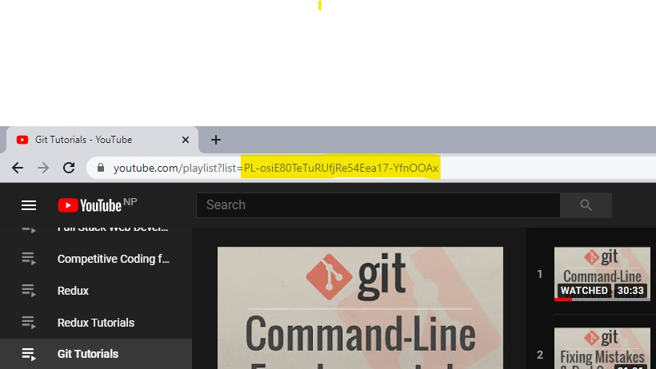

# YouTube Playlist Duration Calculator

A simple node js application to calculate the total duration of videos in a playlist. To find the total duration of a YouTube playlist, you'll need to find the id of the YouTube playlist. 

**To find the YouTube playlist ID:**
Go to any YouTube Playlist and copy the part after `?list=` .

Then enter the id on the input field and click Get Durations to find the total duration of any playlist.

## TO DO:

- [ ] Error Handling
- [ ] Creating Loading animations
- [ ] Better UI
